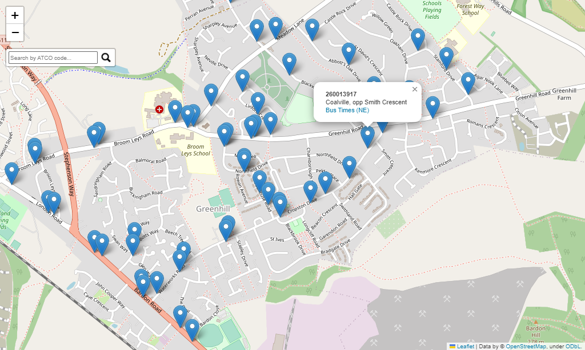

# NaPTAN

> A Python package to easily get and view national public transport access node
> data from the UK's NaPTAN API.

This package lets you extract data from the UK's Department for Transport NaPTAN API.
The national public transport access nodes (NaPTAN) is a [national dataset](https://www.gov.uk/government/publications/national-public-transport-access-node-schema/html-version-of-schema) of all
public transport 'stops' in England, Scotland and Wales.

The data is returned as a pandas.DataFrame, allowing you to filter, analyse and export with ease.

```python
"""
Example code to view all the active NaPTAN stops within Leicester and
Leicestershire on a map in the browser.
"""
import naptan

# get data as a dataframe
# 260 is Leicestershire and 269 is Leicester
leics_stops = naptan.get_area_stops(['260', '269'], status='active')

# View the stops in the browser on an interactive map.
naptan.view_map(leics_stops)
```

|    |   index |   ATCOCode | NaptanCode   |   PlateCode |   CleardownCode | CommonName         |   CommonNameLang |   ShortCommonName |   ShortCommonNameLang | Landmark           |   LandmarkLang | Street            |   StreetLang |   Crossing |   CrossingLang | Indicator   |   IndicatorLang | Bearing   | NptgLocalityCode   | LocalityName   |   ParentLocalityName |   GrandParentLocalityName |   Town |   TownLang |   Suburb |   SuburbLang |   LocalityCentre | GridType   |   Easting |   Northing |   Longitude |   Latitude | StopType   | BusStopType   | TimingStatus   |   DefaultWaitTime |   Notes |   NotesLang |   AdministrativeAreaCode | CreationDateTime        | ModificationDateTime    |   RevisionNumber | Modification   | Status   |
|---:|--------:|-----------:|:-------------|------------:|----------------:|:-------------------|-----------------:|------------------:|----------------------:|:-------------------|---------------:|:------------------|-------------:|-----------:|---------------:|:------------|----------------:|:----------|:-------------------|:---------------|---------------------:|--------------------------:|-------:|-----------:|---------:|-------------:|-----------------:|:-----------|----------:|-----------:|------------:|-----------:|:-----------|:--------------|:---------------|------------------:|--------:|------------:|-------------------------:|:------------------------|:------------------------|-----------------:|:---------------|:---------|
|  0 |    2622 |  260013952 | leiajtmt     |         nan |             nan | Avenue Road        |              nan |               nan |                   nan | 126 Belvoir Road   |            nan | Belvoir Road      |          nan |        nan |            nan | opp         |             nan | N         | E0016841           | Coalville      |                  nan |                       nan |    nan |        nan |      nan |          nan |                0 | UKOS       |    442484 |     313661 |    -1.37248 |    52.7189 | BCT        | MKD           | TIP            |               nan |     nan |         nan |                       88 | 2002-12-10T00:00:00.000 | 2011-09-28T14:00:34.000 |                3 | revise         | active   |
|  1 |    2575 |  260013905 | leijdwgm     |         nan |             nan | Stephenson Way     |              nan |               nan |                   nan | Stephenson Way     |            nan | Bardon Road       |          nan |        nan |            nan | opposite    |             nan | NW        | E0016841           | Coalville      |                  nan |                       nan |    nan |        nan |      nan |          nan |                0 | UKOS       |    443792 |     313504 |    -1.35314 |    52.7174 | BCT        | MKD           | OTH            |               nan |     nan |         nan |                       88 | 2002-12-10T00:00:00.000 | 2008-11-05T00:00:00.000 |                4 | revise         | active   |
|  2 |    2593 |  260013923 | leijdwpa     |         nan |             nan | Kenmore Crescent   |              nan |               nan |                   nan | 144 Greenhill Road |            nan | Greenhill Road    |          nan |        nan |            nan | outside     |             nan | W         | E0016841           | Coalville      |                  nan |                       nan |    nan |        nan |      nan |          nan |                0 | UKOS       |    445504 |     314200 |    -1.3277  |    52.7235 | BCT        | MKD           | OTH            |               nan |     nan |         nan |                       88 | 2002-12-10T00:00:00.000 | 2007-12-05T00:00:00.000 |                2 | revise         | active   |
|  3 |    2764 |  260014097 | leimapaj     |         nan |             nan | Belton Close       |              nan |               nan |                   nan | Belton Close       |            nan | Oakham Drive      |          nan |        nan |            nan | adj         |             nan | N         | E0016841           | Coalville      |                  nan |                       nan |    nan |        nan |      nan |          nan |                0 | UKOS       |    445385 |     314279 |    -1.32945 |    52.7243 | BCT        | MKD           | TIP            |               nan |     nan |         nan |                       88 | 2009-09-15T00:00:00.000 | 2015-06-29T13:48:24.229 |                2 | revise         | active   |
|  4 |    2692 |  260014022 | leijgdam     |         nan |             nan | Stephenson College |              nan |               nan |                   nan | Spring Lane        |            nan | Thornborough Road |          nan |        nan |            nan | adj         |             nan | N         | E0016841           | Coalville      |                  nan |                       nan |    nan |        nan |      nan |          nan |                0 | UKOS       |    442372 |     315358 |    -1.37392 |    52.7342 | BCT        | MKD           | OTH            |               nan |     nan |         nan |                       88 | 2002-12-10T00:00:00.000 | 2013-02-12T14:47:51.000 |                4 | revise         | active   |



## Installation

The latest release (`v0.2.0`) can be [installed from the pypi repository](https://pypi.org/project/naptan/#description)
with:

```cmd
$ pip install naptan
```

## Usage

> More detailed usage instructions and examples can be found [in this jupyter notebook]().

This package has two main uses:

1. Getting NaPTAN data
2. Viewing NaPTAN data

### Getting NaPTAN data

The public transport stops are available to extract from the API with three
functions:

- `naptan.get_all_stops`
- `naptan.get_area_stops`
- `naptan.get_specific_stops`

The ATCO area codes (to be used in the `get_area_stops` function) can be viewed
as part of a lookup table via the package level variable `natpan.ATCO_CODES_LOOKUP`.
They can also be [seen in this table](naptan/atco_code_and_areas.md).
For example "260" is the code for NaPTAN stops in Leicestershire.

### Viewing NaPTAN data

The gathered data can be exported as a geojson, viewed as a folium map object,
or opened and vizualised on a map in the browser. These are achieved by:

- `naptan.export_geojson`
- `naptan.create_map`
- `naptan.view_map`

## Changelog

### v0.2.0

- Rewrite the package so the NaPTAN data is returned as a pandas.DataFrame.
- Add functionality to export the data as a GEOjson (`naptan.export_geojson()`)
- Add functionality to view the stops on a map (`naptan.create_map()` and `naptan.view_map()`)
- Ensure all stops have a Latitude and Longitude value.
- Add the ability to view the ATCO code to area lookup via a package-level
  variable (`naptan.ATCO_CODES_LOOKUP`)

### v0.1.0

- Initial release.
- Add functionality to get NaPTAN data with the following:
  - `naptan.get_all_stops()`
  - `naptan.get_area_stops()`
  - `naptan.get_specific_stops()`
- Data is returned as StopList object.

## License

MIT License. See LICENSE.txt.