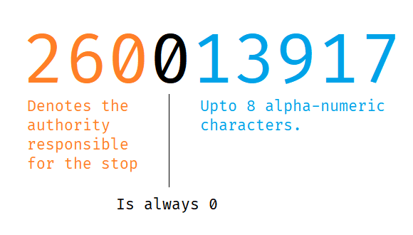

# ATCO Codes

A stop's **ATCO code** uniquely identifies the stop. It is made up of three
parts as below:

The ATCO area code (the first three digits) is used in the `naptan.get_area_stop()`
function. To find the code for a specific authority or region use the table below,
or use the `naptan.ATCO_CODES` variable. For more detail see
["Get stops within an area"](get_area_stops.ipynb) and
["View and use atco codes"](using_atco_codes.ipynb).

## Lookup table

Below you will find, the ATCO code for each authority or area, alongside their corresponding
region and country codes.

!!! example

    Leicestershire has a code of '260' and is in the 'EM' region

!!! tip

    The table below can be sorted -- click on a column header.

Code | Area                       | Region | Country
:----|:---------------------------|:-------|:-------
 639 | Aberdeen                   | S      | Sct
 630 | Aberdeenshire              | S      | Sct
 649 | Angus                      | S      | Sct
 607 | Argyll & Bute              | S      | Sct
 018 | Bath & North East Somerset | SW     | Eng
 020 | Bedford                    | SE     | Eng
 258 | Blackburn with Darwen      | NW     | Eng
 259 | Blackpool                  | NW     | Eng
 532 | Blaenau Gwent              | W      | Wal
 129 | Bournemouth                | SW     | Eng
 038 | Bracknell Forest           | SE     | Eng
 551 | Bridgend                   | W      | Wal
 149 | Brighton and Hove          | SE     | Eng
 010 | Bristol                    | SW     | Eng
 040 | Buckinghamshire            | SE     | Eng
 554 | Caerphilly                 | W      | Wal
 050 | Cambridgeshire             | EA     | Eng
 571 | Cardiff                    | W      | Wal
 522 | Carmarthenshire            | W      | Wal
 021 | Central Bedfordshire       | SE     | Eng
 523 | Ceredigion                 | W      | Wal
 060 | Cheshire East              | NW     | Eng
 061 | Cheshire West & Chester    | NW     | Eng
 668 | Clackmannanshire           | S      | Sct
 513 | Conwy                      | W      | Wal
 080 | Cornwall                   | SW     | Eng
 090 | Cumbria                    | NE     | Eng
 076 | Darlington                 | NE     | Eng
 511 | Denbighshire               | W      | Wal
 109 | Derby                      | EM     | Eng
 100 | Derbyshire                 | EM     | Eng
 110 | Devon                      | SW     | Eng
 120 | Dorset                     | SW     | Eng
 680 | Dumfries & Galloway        | S      | Sct
 640 | Dundee                     | S      | Sct
 130 | Durham                     | NE     | Eng
 618 | East Ayrshire              | S      | Sct
 611 | East Dunbartonshire        | S      | Sct
 627 | East Lothian               | S      | Sct
 612 | East Renfrewshire          | S      | Sct
 220 | East Riding of Yorkshire   | Y      | Eng
 140 | East Sussex                | SE     | Eng
 620 | Edinburgh                  | S      | Sct
 150 | Essex                      | SE     | Eng
 111 | Exeter                     | SW     | Eng
 669 | Falkirk                    | S      | Sct
 650 | Fife                       | S      | Sct
 512 | Flintshire                 | W      | Wal
 609 | Glasgow                    | S      | Sct
 160 | Gloucestershire            | SW     | Eng
 490 | Greater London             | L      | Eng
 180 | Greater Manchester         | NW     | Eng
 540 | Gwynedd                    | W      | Wal
 068 | Halton                     | NW     | Eng
 190 | Hampshire                  | SW     | Eng
 075 | Hartlepool                 | NE     | Eng
 209 | Herefordshire              | WM     | Eng
 210 | Hertfordshire              | SE     | Eng
 670 | Highland                   | S      | Sct
 613 | Inverclyde                 | S      | Sct
 541 | Isle of Anglesey           | W      | Wal
 230 | Isle of Wight              | SE     | Eng
 240 | Kent                       | SE     | Eng
 229 | Kingston upon Hull         | Y      | Eng
 250 | Lancashire                 | NW     | Eng
 269 | Leicester                  | EM     | Eng
 260 | Leicestershire             | EM     | Eng
 270 | Lincolnshire               | EM     | Eng
 029 | Luton                      | SE     | Eng
 249 | Medway                     | SE     | Eng
 280 | Merseyside                 | NW     | Eng
 553 | Merthyr Tydfil             | W      | Wal
 079 | Middlesbrough              | NE     | Eng
 628 | Midlothian                 | S      | Sct
 049 | Milton Keynes              | SE     | Eng
 533 | Monmouthshire              | W      | Wal
 638 | Moray                      | S      | Sct
 920 | National - National Air    | GB     | GB
 900 | National - National Coach  | GB     | GB
 930 | National - National Ferry  | GB     | GB
 910 | National - National Rail   | GB     | GB
 910 | National - National Rail   | GB     | GB
 940 | National - National Tram   | GB     | GB
 582 | Neath Port Talbot          | W      | Wal
 531 | Newport                    | W      | Wal
 290 | Norfolk                    | EA     | Eng
 617 | North Ayrshire             | S      | Sct
 228 | North East Lincolnshire    | EM     | Eng
 616 | North Lanarkshire          | S      | Sct
 227 | North Lincolnshire         | EM     | Eng
 019 | North Somerset             | SW     | Eng
 291 | Norwich                    | SW     | Eng
 320 | North Yorkshire            | Y      | Eng
 300 | Northamptonshire           | EM     | Eng
 310 | Northumberland             | NE     | Eng
 339 | Nottingham                 | EM     | Eng
 330 | Nottinghamshire            | EM     | Eng
 602 | Orkney Islands             | S      | Sct
 340 | Oxfordshire                | SE     | Eng
 521 | Pembrokeshire              | W      | Wal
 648 | Perth & Kinross            | S      | Sct
 059 | Peterborough               | EM     | Eng
 118 | Plymouth                   | SW     | Eng
 128 | Poole                      | SW     | Eng
 199 | Portsmouth                 | SW     | Eng
 561 | Powys                      | W      | Wal
 039 | Reading                    | SE     | Eng
 078 | Redcar & Cleveland         | NE     | Eng
 614 | Renfrewshire               | S      | Sct
 552 | Rhondda Cynon Taff         | W      | Wal
 268 | Rutland                    | EM     | Eng
 690 | Scottish Borders           | S      | Sct
 603 | Shetland Islands           | S      | Sct
 350 | Shropshire                 | WM     | Eng
 037 | Slough                     | SE     | Eng
 360 | Somerset                   | SW     | Eng
 619 | South Ayrshire             | S      | Sct
 017 | South Gloucestershire      | SW     | Eng
 615 | South Lanarkshire          | S      | Sct
 370 | South Yorkshire            | Y      | Eng
 198 | Southampton                | SW     | Eng
 158 | Southend-on-Sea            | SE     | Eng
 380 | Staffordshire              | WM     | Eng
 660 | Stirling                   | S      | Sct
 077 | Stockton-on-Tees           | NE     | Eng
 389 | Stoke-on-Trent             | WM     | Eng
 390 | Suffolk                    | EA     | Eng
 400 | Surrey                     | SE     | Eng
 581 | Swansea                    | W      | Wal
 468 | Swindon                    | SW     | Eng
 359 | Telford & Wrekin           | WM     | Eng
 159 | Thurrock                   | SE     | Eng
 119 | Torbay                     | SW     | Eng
 534 | Torfaen                    | W      | Wal
 410 | Tyne & Wear                | NE     | Eng
 572 | Vale of Glamorgan          | W      | Wal
 069 | Warrington                 | NW     | Eng
 420 | Warwickshire               | WM     | Eng
 030 | West Berkshire             | SE     | Eng
 608 | West Dunbartonshire        | S      | Sct
 629 | West Lothian               | S      | Sct
 430 | West Midlands              | WM     | Eng
 440 | West Sussex                | SE     | Eng
 450 | West Yorkshire             | Y      | Eng
 601 | Western Isles              | S      | Sct
 460 | Wiltshire                  | SW     | Eng
 036 | Windsor & Maidenhead       | SE     | Eng
 035 | Wokingham                  | SE     | Eng
 200 | Worcestershire             | WM     | Eng
 514 | Wrexham                    | W      | Wal
 329 | York                       | Y      | Eng